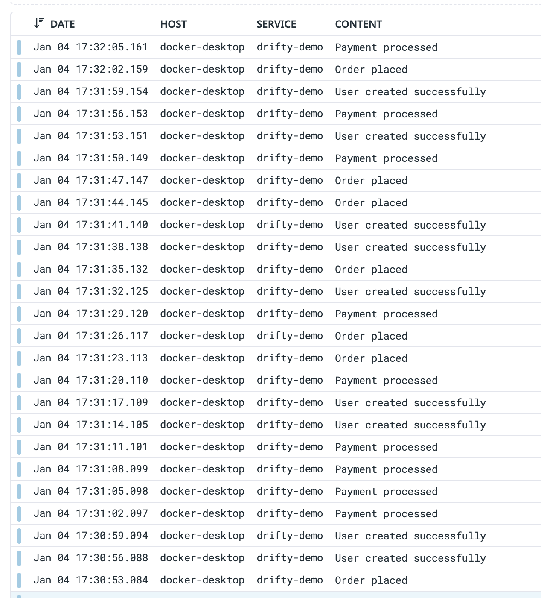

### Drifty Demo

Demo / Testbed for [https://github.com/joswayski/drifty]()

To run, simply create an `.env` file with your `DD_API_KEY` and `docker compose up -d --build`.

You should start to see logs in Datadog:

